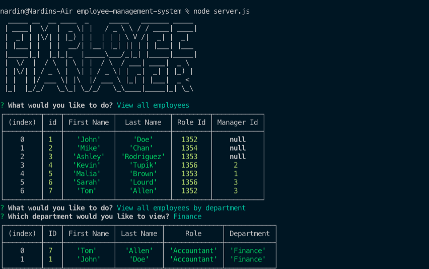

# Employee Management System

## Description

Easy to use CLI interface designed for organizations to manage and track employee information. The application is a simple CMS that has been built with node, inquirer and MySQL technologies.

Screenshot of application:

To watch a screencast of the running application, please click here: [Screencast](https://drive.google.com/file/d/1uvXVqbCusxT-nlAFcyctf6kmRpy8fC-t/view)

## Table of Contents

* [Installation](#Installation)
* [Usage](#Usage)
* [Contributing](#Contributing)
* [Tests](#Tests)
* [License](#License)
* [Questions](#Questions)

## Installation
To install, simply clone or download the repository. Keep in mind that you may need to set up npm and a database management system in order to view and run the database.

## Usage
This application allows an organization or business owners to easily manage their workforce database and create new entries for newly hired employees. It allows the user to:
- Add departments, roles, employees
- View departments, roles, employees
- Remove an employee from the database
- Update employee roles

## Contributing
We love seeing community contribution to any opensource project! If you would like to contribute, please do.

## Tests
No tests available at the moment. Please drop us a message if you would like to discuss. Contact information included below.

## License
This project is released under BSD 2 Clause opensource license:

https://opensource.org/licenses/BSD-2-Clause

## Questions
For more about my work, check out my Github profile: https://github.com/nard1n

If you have any questions and would like to chat, please feel free to send me an email directly to nardin.lachowski@gmail.com
